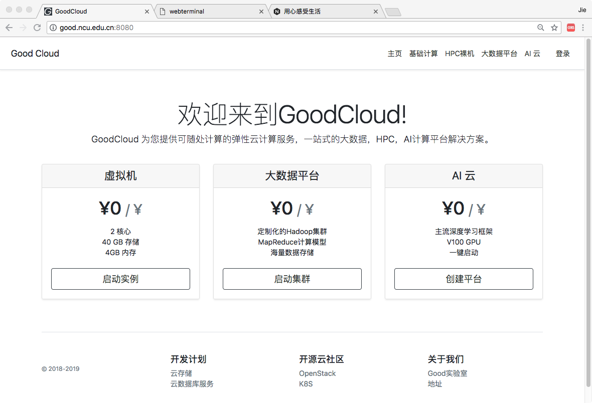
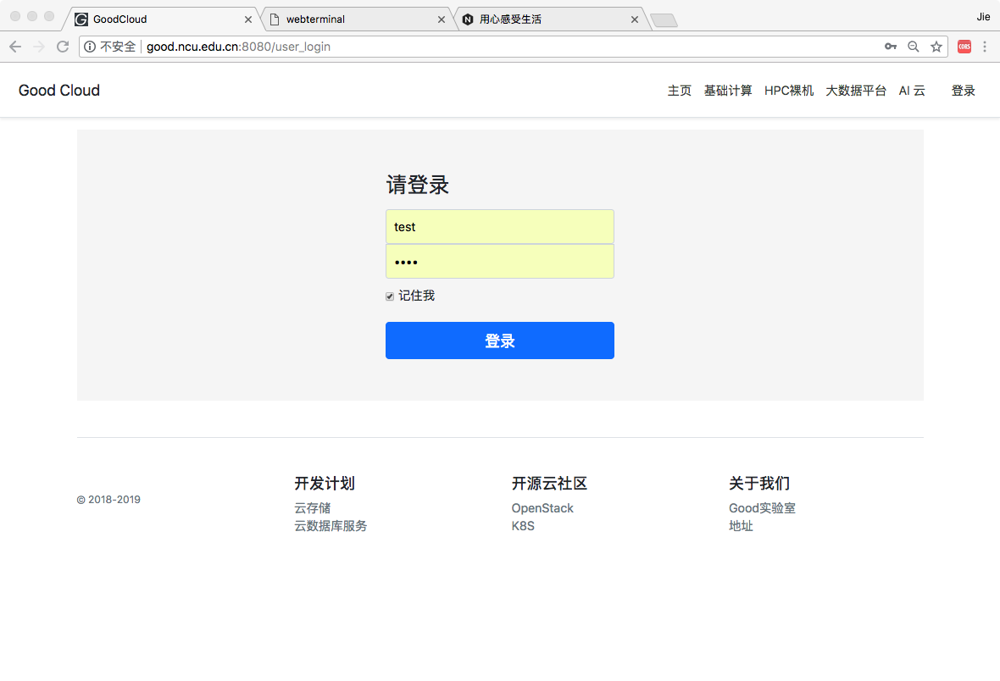
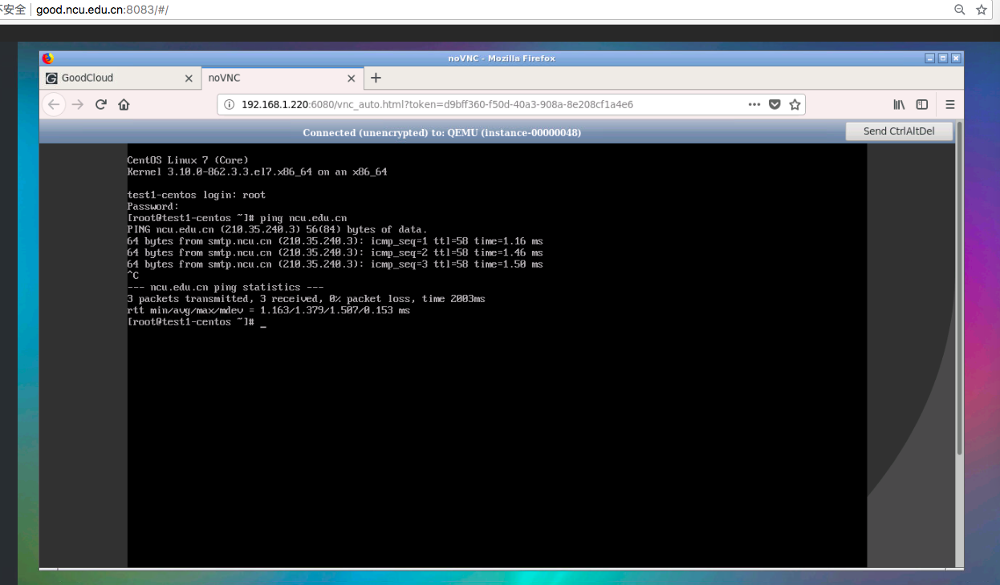

# GoodCloud
GoodLab Cloud System

### Architecture

- 整体部署情况，部署基本OpenStack环境可看到 doc 中的 DeployOpenStack

- GoodCloud 主页

- 目前项目结合OpenStack管理系统实现了简单的用户认证和实例使用。

- 开发计划
    - 终端代理开发，类似于jupyter里面的终端。
    - 基于Ironic做裸机HPC管理部署系统，整理驱动安装脚本，争取一键启动带GPU的高性能裸机。
    - 基于Hadoop实现大数据计算集群服务，用户可以以最便捷的方式启动Hadoop进行计算任务。
    - 基于K8S，kubeflow，gpu 加速设备实现caffe，tensorflow 等深度学习高性能计算集群。
    - 基于Gluster FS实现云存储系统。

- 这个仓库里白包含了，OpenStack基本环境部署，GoodCloud前台代码(基于 Angular6开发)    

- 下面这个仓库是系统的后台代码
Server Side
https://github.com/vajn/GoodCloudJavaService

