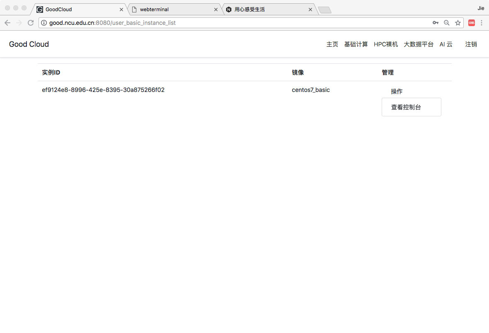

# GoodCloud
Good实验室公有云平台架构

- OpenStack部署

1、部署规划
https://github.com/vajn/GoodCloud/blob/master/doc/DeployOpenstack/1_Cluster_Architecture.md

2、节点的主要服务
https://github.com/vajn/GoodCloud/blob/master/doc/DeployOpenstack/2_Cluster_Service.md

3、操作系统安装
https://github.com/vajn/GoodCloud/blob/master/doc/DeployOpenstack/3_Centos_7_Minimal_Installation.md

4、集群网络规划和配置
https://github.com/vajn/GoodCloud/blob/master/doc/DeployOpenstack/4_ClusterNetworkConfiguration.md

5、packstack部署集群
https://github.com/vajn/GoodCloud/blob/master/doc/DeployOpenstack/5_ClusterInstall_with_packstack.md

6、OpenStack网络初始化
https://github.com/vajn/GoodCloud/blob/master/doc/DeployOpenstack/6_Openstack_Cluster_VitualNetwork.md

7、配置集群公网访问
https://github.com/vajn/GoodCloud/blob/master/doc/DeployOpenstack/7_Config_A_PublicIP_To_OurCloud.md

8、OpenStack公共镜像注入初始密码
https://github.com/vajn/GoodCloud/blob/master/doc/DeployOpenstack/11_Inject_password_from_dashboard.md

- 二次开发GoodCloud主页(http://good.ncu.edu.cn:8086)

公开测试账号intel，密码intel.123
测试用户的虚拟机的账号密码都是centos

- Window 服务

- 基于nodejs和xterm的web终端

- 目前项目结合OpenStack管理系统实现了简单的用户认证和实例使用。
- 开发计划
    - 基于Ironic做裸机HPC管理部署系统，整理驱动安装脚本，争取一键启动带GPU的高性能裸机。
    - 基于Hadoop实现大数据计算集群服务，用户可以以最便捷的方式启动Hadoop进行计算任务。
    - 基于K8S，kubeflow，gpu 加速设备实现caffe，tensorflow 等深度学习高性能计算集群。
    - 基于Gluster FS实现云存储系统。
- 这个仓库里白包含了，OpenStack基本环境部署，GoodCloud前台代码(基于 Angular6开发)    
- 下面这个仓库是系统的后台代码
  Server Side

- Java代码 https://github.com/vajn/GoodCloudJavaService

- Python代码 https://github.com/vajn/GoodCloudPythonService

