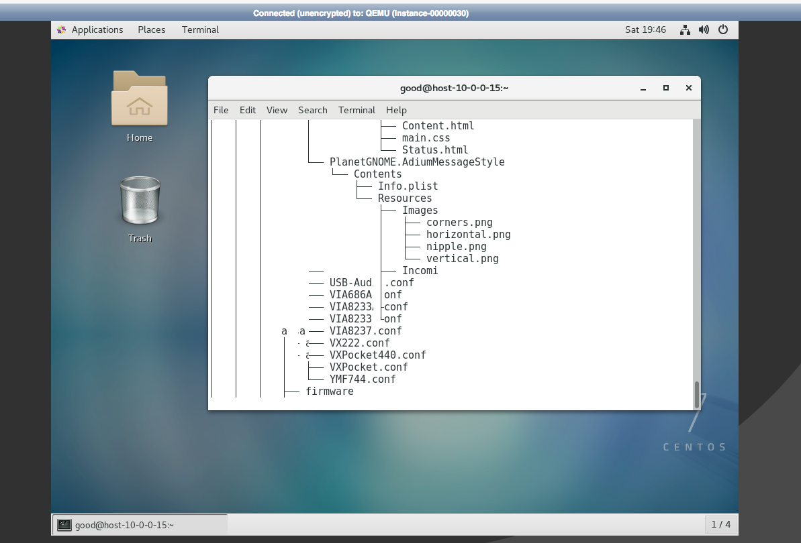

## Install a desktop for centos cloud server

The default openstack cloud image is installed without the GUI we can install it later.

- Install GUI In CentOS

While there are many different graphical user interfaces available for Linux, we install GNOME there, which is what CentOS uses by default.

This is as simple as installing the "GNOME Desktop" package group, which is already configured to install hundreds more packages that are required for a GUI installation, that this may take a while

```
yum groupinstall "GNOME Desktop" -y
```

- Start The GUI

By default after installing the "GNOME Desktop" group of packages, the default target will not have changed, meaning that after a reboot the GUI will not automatically be loaded. We can check the current default target as shown below

```
systemctl get-default

cmdout:multi-user.target
```

The target is similar to the old run levels, in this case multi-user.target is equivalent to run level 3 meaning that after a reboot the GUI will not be loaded here. We instead set the default to graphical.target which is equivalent to run level5

```
systemctl set-default graphical.target

cmdout:
Removed symlink /etc/systemd/system/default.target.
Created symlink from /etc/systemd/system/default.target to /usr/lib/systemd/system/graphical.target.

systemctl get-default

cmdout:
graphical.target
```

While this has changed the default target which is accessed during system boot, our current target is still the multi-user.target. We can change to the GUI by performing following command which will change us to the GUI immediately.

```
systemctl isolate graphical.target
```

Alternatively a system reboot would also work, as all future boots should boot to the graphical target by default.

- After reboot




