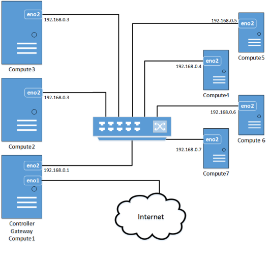

## Cluster Architecture

### Introduction

​	The first version od the cluster has one controller node and multiple compute nodes, and the controller node itself aslo acts as a compute node.

​	Controller's first network card(eno1) is connected to the Internet, Internal compute nodes are interconnected through switch. And through the computing node as a gateway to go to the internet.

​	This architecture is simple but fully utilizes system handware resources.
