## OpenStack SDN dashboard操作，一个私网网段一个公网网段

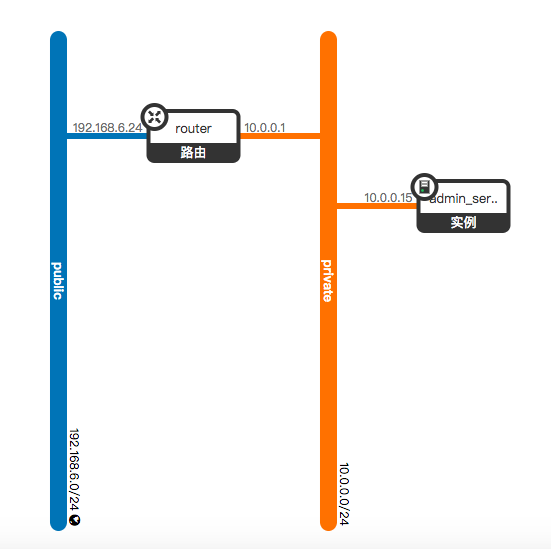

**上图是整个网络的拓扑结构**

路由的详细配置
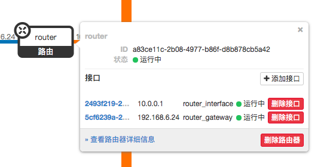

#### Create Step

- Step1:创建public网络

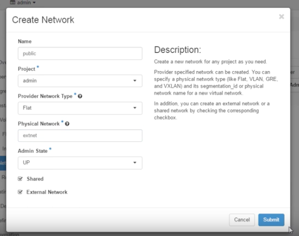

- Step2:创建 public 网络

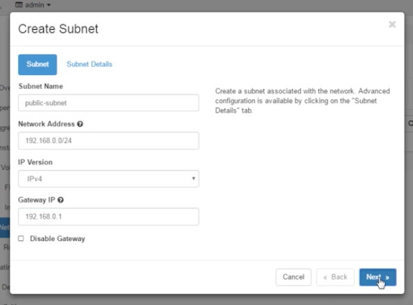

- Step3:创建 public subnet

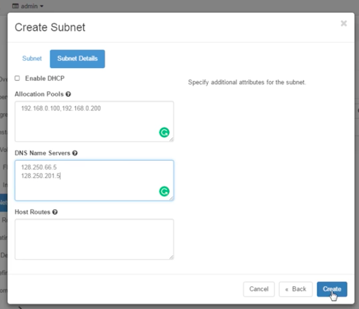

- Step4:创建 pravite 网络

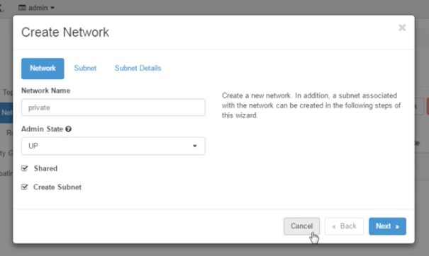

- Step5: 创建 private subnet

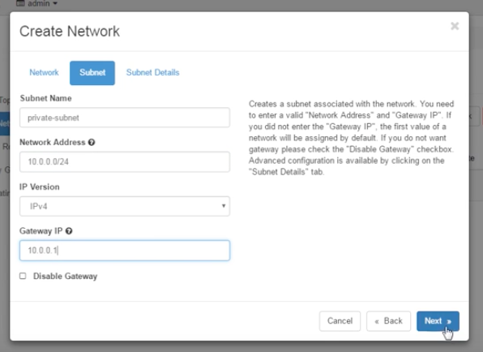

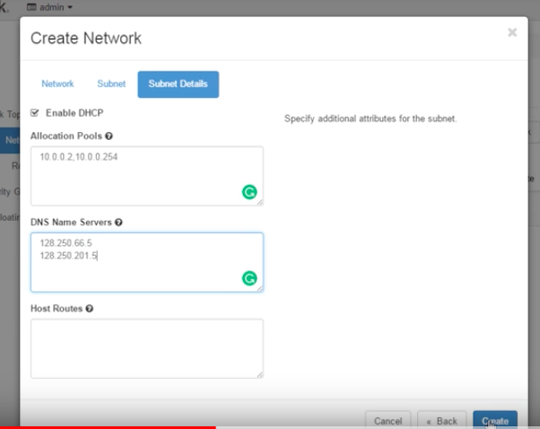

- Step6: 创建虚拟路由

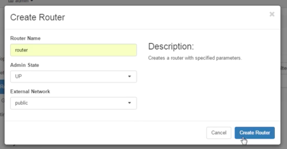

- Step7: 给private网络加一个端口

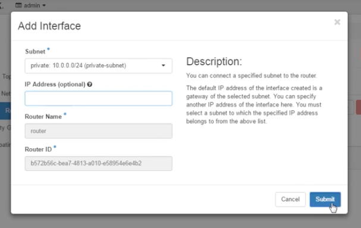

# MTU配置

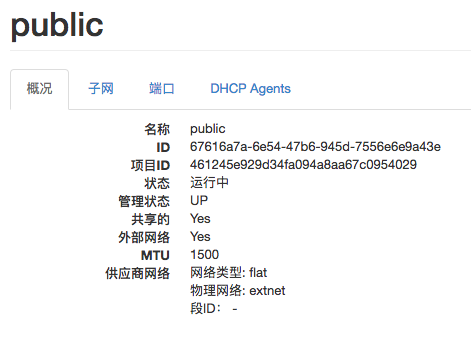

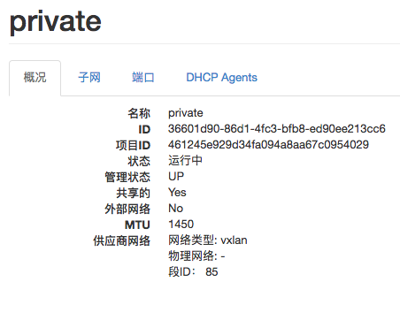

# 关于默认MTU为1450导致windows无法访问外网的解决办法，给windows网络配置中加入1450的MTU配置即可

