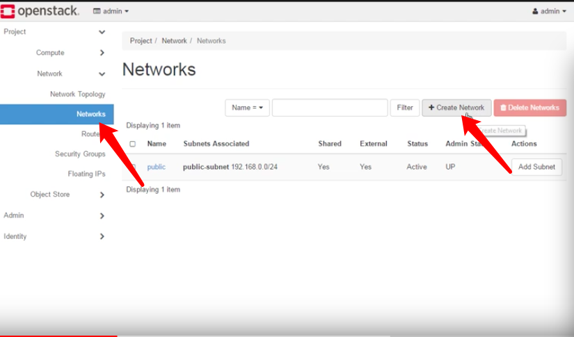

## OpenStack SDN dashboard操作，一个私网网段一个公网网段

**上图是整个网络的拓扑结构**

路由的详细配置

#### Create Step

- Step1:创建public网络

- Step2:创建 public 网络

- Step3:创建 public subnet

- Step4:创建 pravite 网络

- Step5: 创建 private subnet

- Step6: 创建虚拟路由

- Step7: 给private网络加一个端口

# MTU配置

# 关于默认MTU为1450导致windows无法访问外网的解决办法，给windows网络配置中加入1450的MTU配置即可

