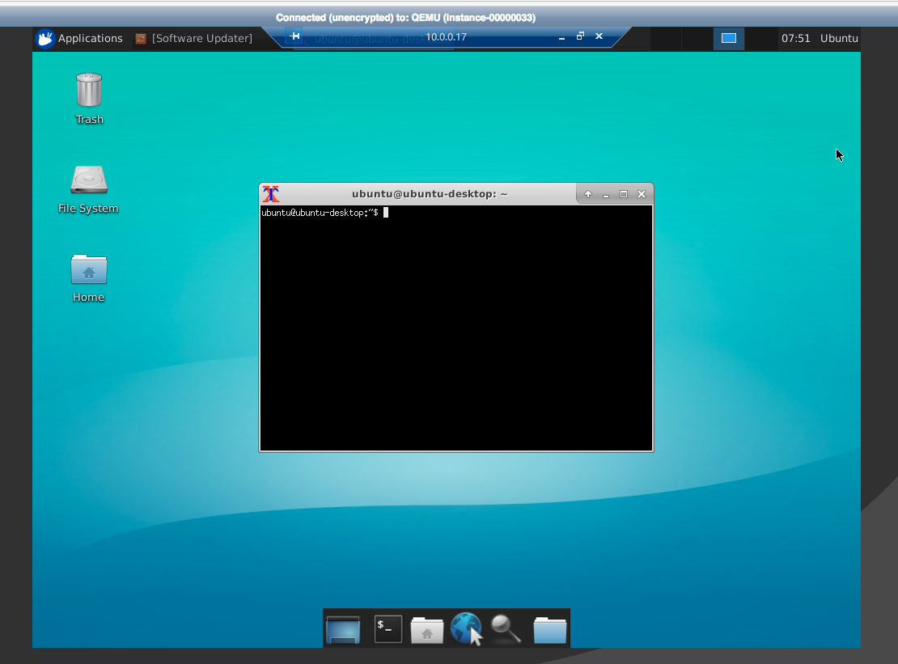

###  Adding a graphical interface to your Ubuntu Openstack instance

**Sometimes we need graphical interface. In this doc we add a graphical interface to ubuntu**

- Create a intance of ubuntu 14.04 or ubuntu 16.04
- Install desktop service

```
sudo apt-get update
sudo apt-get install --no-install-recommends ubuntu-desktop
sudo apt-get install firefox xrdp
sudo apt-get install unity-lens-applications unity-lens-files
sudo apt-get install xfce4
sudo apt-get install gnome-icon-theme-full tango-icon-theme
echo xfce4-session >~/.xsession
```

- set a password for ubuntu , and reboot the instance
- connect to ubuntu desktop




