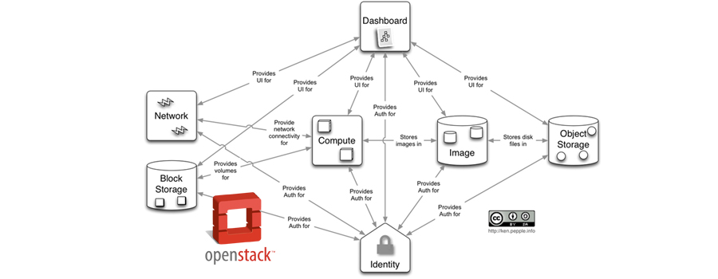

##	What's openstack

Openstack is a cloud operating system that controls large-scale computing, storage, and network resource pools through the data center. All the management can be done through the front-end interface administrator. 

## Basic Components of Openstack

There are basically components of Openstack and what they do.

| Component Name                          | Description                                                  |
| --------------------------------------- | ------------------------------------------------------------ |
| Openstack Compute(Nova)                 | OpenStack compute(codename Nova) is the componet which allows the user to create and manage visual servers using the machine images. It is the brain of the Cloud, Openstack compute provisions and manages large networks of virtual machines. |
| Block Storage(Cinder)                   | This component provides persistent block storage to running instances. The flexible architecture makes creating and managing block storage devices very easy. |
| Object Storage(Swift)                   | This component stores and retrieves unstructured data objects through the HTTP based APIs. Further, it is also fault tolerant due to its data replication and scale out architecture. |
| Openstack Networking(Neutron)           | It is a pluggable, scalable and API-driven system for managing networks. Openstack networking is useful for VLAN management, management of IP addresses to different VMs and management of firewalls using these components. |
| Identity Service(Keystone)              | This provides a central directory of users mapped to the Openstack services. It is used to provide an authentication and authorization service for other Openstack services. |
| Openstack Telemetry Service(Ceilometer) | It monitors the usage of the Cloud servcies and decides the billing accordingly. This component is also used to decide the scalability and obtain the statistics regarding the usage. |
| Dashboard(Horizon)                      | This component provides a web-based portal interact with all the underlying Openstack services., such as NOVA, Neutron, etc |

