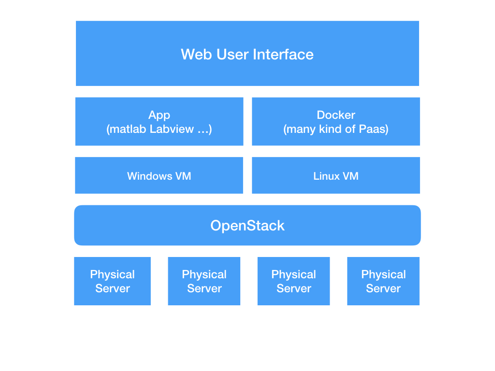
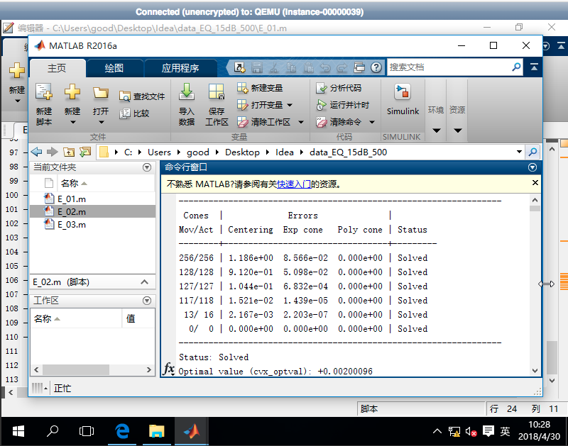
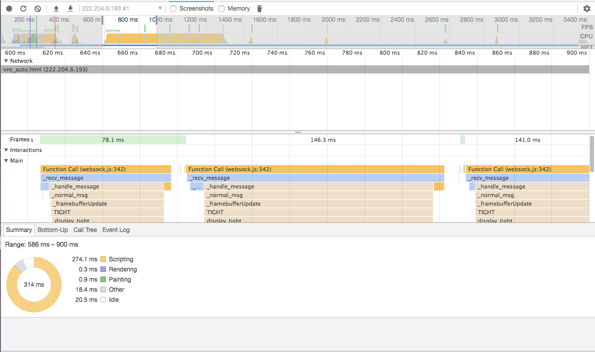

What is openstack

	OpenStack is a cloud operating system that controls large pools of compute, storage, and networking resources throughout a datacenter, all managed through a dashboard that gives administrators control while empowering their users to provision resources through a web interface.

Our Cluster Architecture Design

	The first version of the cluster has one controller node and multiple compute nodes, and the controller node itself aslo acts as a compute node.

	Controller's first network card(eno1) is connected to the Internet, Internal compute nodes are interconnected through switch. And through the computing node as a gateway to go to the internet.

	This architecture is simple but fully utilizes system handware resources.

Good Cloud Service

	We mainly provide windows virtual machine for cloud users, Linux desktop virtual machine service. Labview , Matlab is deployed on the windows virtual machine. We provide the desktop and console versions of the Linux service. And quickly deploy rich PAAS applications through docker.

- Widows vm services

- Linux vm services

Next Step

- Implementing nodes with GPU computing 

- Research on NOVNC speed up project

- Openstack application redevelopment
  https://github.com/vajn/GoodCloud
